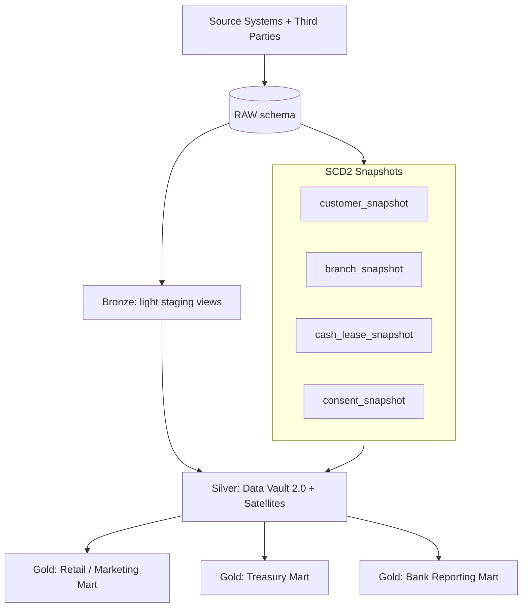
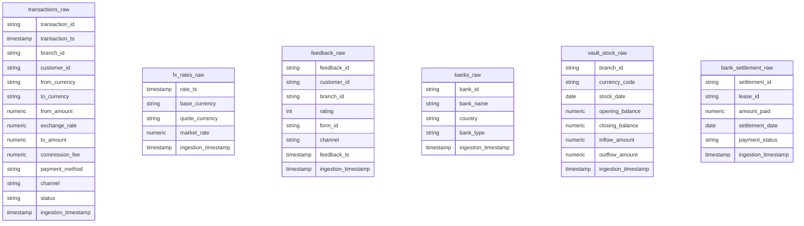
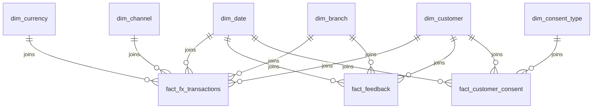
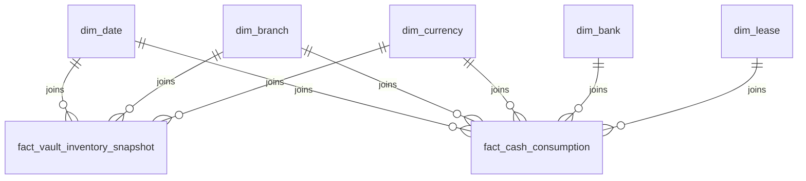
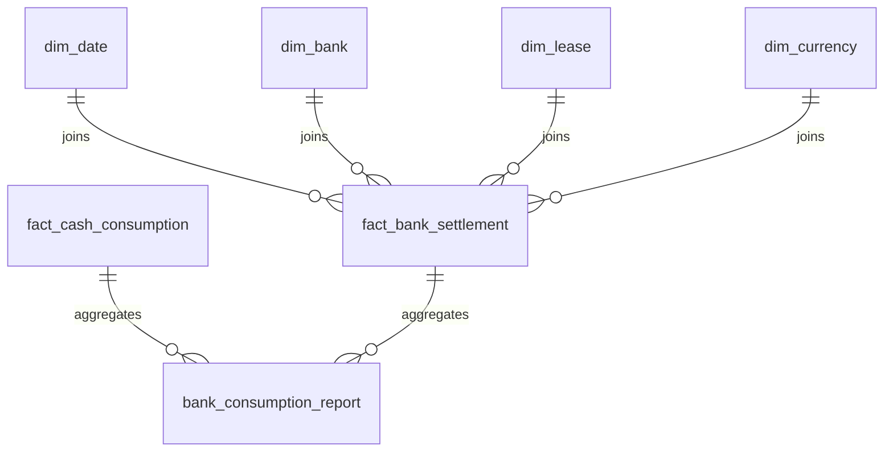

# 💱 FX Currency Exchange Data Platform (v2)

Enterprise-grade FX Data Platform built using:

- **Raw → Bronze → Silver → Gold**
- **Silver = Data Vault 2.0** (Hubs / Links / Satellites)
- **SCD Type 2 via dbt Snapshots** (customer, branch, cash_lease, consent)
- **Gold = Dimensional marts** for:
  1) Retail / Marketing Analytics  
  2) Treasury Analytics  
  3) Bank Reporting  

---

## 🏗️ High-level Architecture



> **v2 rule:** Gold models **never read RAW/Bronze** directly. Gold consumes **Silver only**.

---

# 🥉 Bronze Layer

### Purpose
- Lightweight staging layer (generally **views**)
- Minimal standardization, no heavy business rules
- Keeps ingestion safe from downstream overwrites

### v2 update: moved to snapshots
These subject areas are **not** built as bronze models anymore; they are historized with snapshots:
- Customer
- Branch
- Cash Lease
- Consent

Bronze remains for event-style sources:
- Transactions
- Feedback
- FX Rates
- Vault Stock
- Bank Settlement
- Banks master (can remain bronze or be lifted to a silver satellite)

---

## 🥉 Bronze ER-style Diagram (raw-aligned)



---

# 🔁 Snapshots (SCD Type 2)

Snapshots generate history using `dbt_valid_from` / `dbt_valid_to`:

- `customer_snapshot`
- `branch_snapshot`
- `cash_lease_snapshot`
- `consent_snapshot`

Silver satellites (SCD2) are exposed as curated “current + history” structures based on these snapshots.

---

# 🥈 Silver Layer — Data Vault 2.0

## What lives in Silver
- **Hubs**: business keys (stable identifiers)
- **Links**: relationships between hubs
- **Satellites**: descriptive attributes and metrics
- **Event satellites**: append/merge style (transactions, feedback, vault, settlements)
- **SCD2 satellites**: derived from snapshots for customer/branch/lease/consent

---

## 🥈 Silver ER-style Diagram (Data Vault)

```mermaid
erDiagram
    hub_customer {
        string customer_hk
        string business_key
        timestamp load_date
        string record_source
    }
    hub_branch {
        string branch_hk
        string business_key
        timestamp load_date
        string record_source
    }
    hub_transaction {
        string transaction_hk
        string business_key
        timestamp load_date
        string record_source
    }
    hub_currency {
        string currency_hk
        string currency_code
        timestamp load_date
        string record_source
    }
    hub_bank {
        string bank_hk
        string business_key
        timestamp load_date
        string record_source
    }
    hub_cash_lease {
        string lease_hk
        string business_key
        timestamp load_date
        string record_source
    }
    hub_consent {
        string consent_hk
        string business_key
        timestamp load_date
        string record_source
    }
    hub_feedback {
        string feedback_hk
        string business_key
        timestamp load_date
        string record_source
    }
    hub_settlement {
        string settlement_hk
        string business_key
        timestamp load_date
        string record_source
    }

    link_txn_customer {
        string link_hk
        string transaction_hk
        string customer_hk
        timestamp load_date
        string record_source
    }
    link_txn_branch {
        string link_hk
        string transaction_hk
        string branch_hk
        timestamp load_date
        string record_source
    }
    link_txn_currency {
        string link_hk
        string transaction_hk
        string from_currency_hk
        string to_currency_hk
        timestamp load_date
        string record_source
    }
    link_lease_bank {
        string link_hk
        string lease_hk
        string bank_hk
        timestamp load_date
        string record_source
    }
    link_lease_currency {
        string link_hk
        string lease_hk
        string currency_hk
        timestamp load_date
        string record_source
    }
    link_customer_consent {
        string link_hk
        string consent_hk
        string customer_hk
        timestamp load_date
        string record_source
    }

    sat_customer_details {
        string customer_hk
        string nationality
        string risk_rating
        string kyc_status
        timestamp effective_from
        timestamp effective_to
        boolean is_current
        string hashdiff
    }
    sat_branch_details {
        string branch_hk
        string city
        string country
        timestamp effective_from
        timestamp effective_to
        boolean is_current
        string hashdiff
    }
    sat_cash_lease_details {
        string lease_hk
        string bank_id
        string currency_code
        numeric lease_amount
        numeric interest_rate
        date lease_start
        date lease_end
        string lease_status
        timestamp effective_from
        timestamp effective_to
        boolean is_current
        string hashdiff
    }
    sat_consent_details {
        string consent_hk
        string customer_hk
        string consent_type
        boolean consent_flag
        timestamp consent_ts
        boolean is_current
        string hashdiff
    }

    sat_transaction_financials {
        string transaction_hk
        timestamp transaction_ts
        numeric from_amount
        numeric exchange_rate_applied
        numeric market_rate_at_time
        numeric spread
        numeric commission_fee
        numeric net_revenue
        string channel
        string status
        string hashdiff
    }
    sat_feedback_details {
        string feedback_hk
        timestamp feedback_ts
        int rating
        string comments
        string hashdiff
    }
    sat_vault_stock_daily {
        string branch_currency_date_hk
        string branch_hk
        string currency_hk
        date stock_date
        numeric opening_balance
        numeric closing_balance
        numeric inflow_amount
        numeric outflow_amount
        string hashdiff
    }
    sat_settlement_details {
        string settlement_hk
        string lease_hk
        date settlement_date
        numeric amount_paid
        string payment_status
        string hashdiff
    }
    sat_bank_details {
        string bank_hk
        string bank_name
        string country
        string bank_type
        string hashdiff
    }

    hub_customer ||--o{ link_txn_customer : relates
    hub_transaction ||--o{ link_txn_customer : relates

    hub_branch ||--o{ link_txn_branch : relates
    hub_transaction ||--o{ link_txn_branch : relates

    hub_currency ||--o{ link_txn_currency : relates
    hub_transaction ||--o{ link_txn_currency : relates

    hub_cash_lease ||--o{ link_lease_bank : relates
    hub_bank ||--o{ link_lease_bank : relates

    hub_cash_lease ||--o{ link_lease_currency : relates
    hub_currency ||--o{ link_lease_currency : relates

    hub_customer ||--o{ link_customer_consent : relates
    hub_consent ||--o{ link_customer_consent : relates

    hub_customer ||--o{ sat_customer_details : describes
    hub_branch ||--o{ sat_branch_details : describes
    hub_cash_lease ||--o{ sat_cash_lease_details : describes
    hub_consent ||--o{ sat_consent_details : describes

    hub_transaction ||--o{ sat_transaction_financials : measures
    hub_feedback ||--o{ sat_feedback_details : measures
    hub_settlement ||--o{ sat_settlement_details : measures
    hub_bank ||--o{ sat_bank_details : describes
```



---

# 🥇 Gold Layer — Dimensional Marts

## v2 Rule (strict)
Gold models **ONLY** read from **Silver hubs/links/satellites**.

---

## 1️⃣ Gold Mart: Retail / Marketing Analytics

### Star schema (conceptual)


**Gold sources (Silver-only):**
- `fact_fx_transactions` ← `sat_transaction_financials`
- `fact_feedback` ← `sat_feedback_details`
- `fact_customer_consent` ← `sat_consent_details`
- dims ← `sat_*_details` + `hub_currency`

---

## 2️⃣ Gold Mart: Treasury Analytics



**Gold sources (Silver-only):**
- inventory ← `sat_vault_stock_daily`
- leases ← `sat_cash_lease_details`
- banks ← `sat_bank_details`

---

## 3️⃣ Gold Mart: Bank Reporting



**Gold sources (Silver-only):**
- settlements ← `sat_settlement_details`
- leases ← `sat_cash_lease_details`
- consumption ← `fact_cash_consumption` (treasury mart)

---

# 📂 Folder Structure

```
models/
 ├── bronze/
 ├── silver/
 │   ├── hubs/
 │   ├── links/
 │   └── satellites/
 └── gold/
     ├── retail_analytics/
     ├── treasury_analytics/
     └── bank_reporting/
snapshots/
macros/
raw_data/
scripts/
```

---

# 🧩 dbt Implementation Notes

- **PostgreSQL compatibility**:
  - No `QUALIFY` (use Postgres patterns like `LATERAL` joins / subqueries)
  - Date keys use `cast(to_char(date,'YYYYMMDD') as int)` (no `to_number(text)`)

- **Incremental strategy (typical)**:
  - Hubs / Links: `incremental + merge`
  - Event satellites: `incremental + merge`
  - SCD2 satellites: **snapshots**

---

# ✅ Version Notes (v2)

- Customer, Branch, Cash Lease, Consent moved to snapshots (SCD2)
- Updated dependent hubs/links to source snapshots safely (`dbt_valid_to is null` when needed)
- Gold models updated to use **Silver only**
- README diagrams restored and updated to reflect v2 changes
