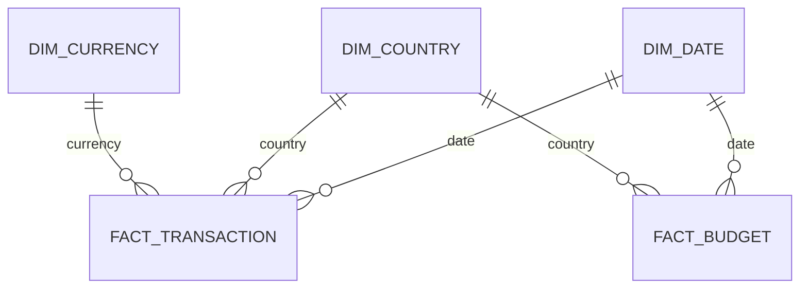
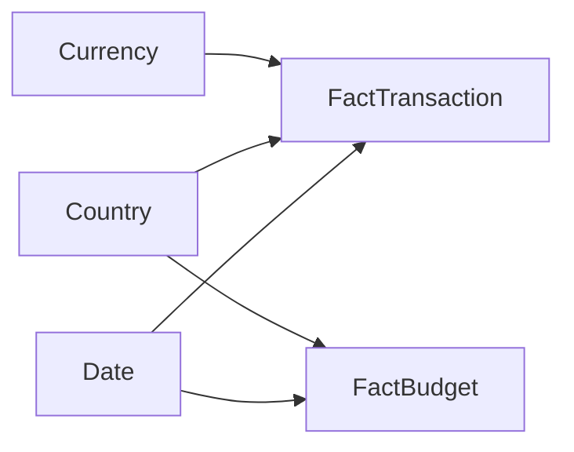
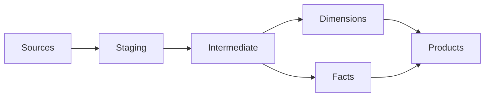

# Data Model

## Overview

The platform uses dimensional modelling for analytical consumption while maintaining reusable intermediate transformation models.

## Entity Relationship

## Star Schema

## Fact Tables

### fact_transaction

**Grain**

One financial transaction.

Measures

- Amount
- Converted Amount
- Transaction Count

### fact_budget

**Grain**

Budget allocation by period and business unit.

Measures

- Budget Amount
- Forecast
- Variance

## Dimensions

- dim_date
- dim_country
- dim_currency

## Data Quality

- Unique tests
- Not Null tests
- Relationships
- Accepted Values
- Freshness monitoring

## Lineage

## Future Roadmap

- Semantic Layer
- Metrics Layer
- Data Vault support
- CDC ingestion
