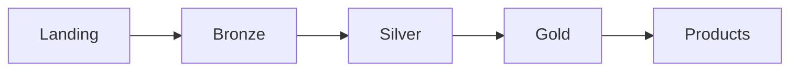
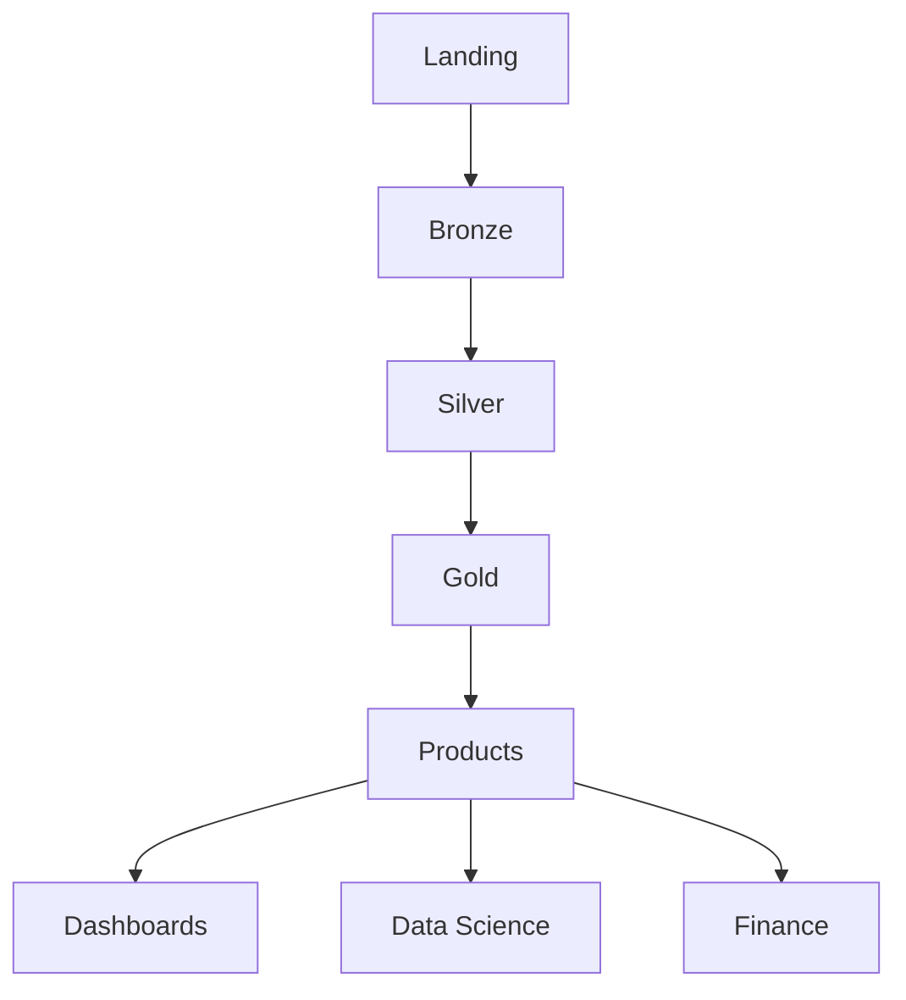

# Medallion Architecture

## Purpose

The platform separates ingestion, transformation and business modelling into distinct layers to improve quality, governance and scalability.

## Flow

## Bronze

- Raw ingestion
- Historical preservation
- Minimal transformations

## Silver

- Cleansing
- Standardisation
- Business key generation

## Gold

- Dimensional modelling
- Facts and dimensions
- Business logic

## Product Layer

- Reporting datasets
- Finance analytics
- Budget variance
- Currency analytics

## Benefits

- Independent testing
- Easier maintenance
- Better governance
- Reusable transformations

## End-to-End Flow

## Related ADRs

- ADR-001 Curated Full Refresh
- ADR-002 Data Product Layer
- ADR-003 Budget Transaction Model
- ADR-004 Alerting Strategy
